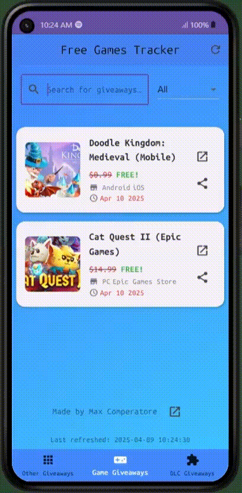
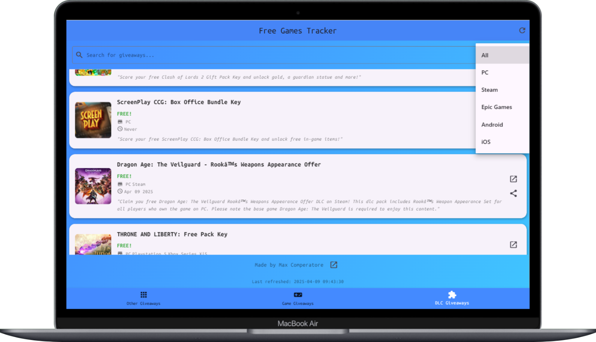
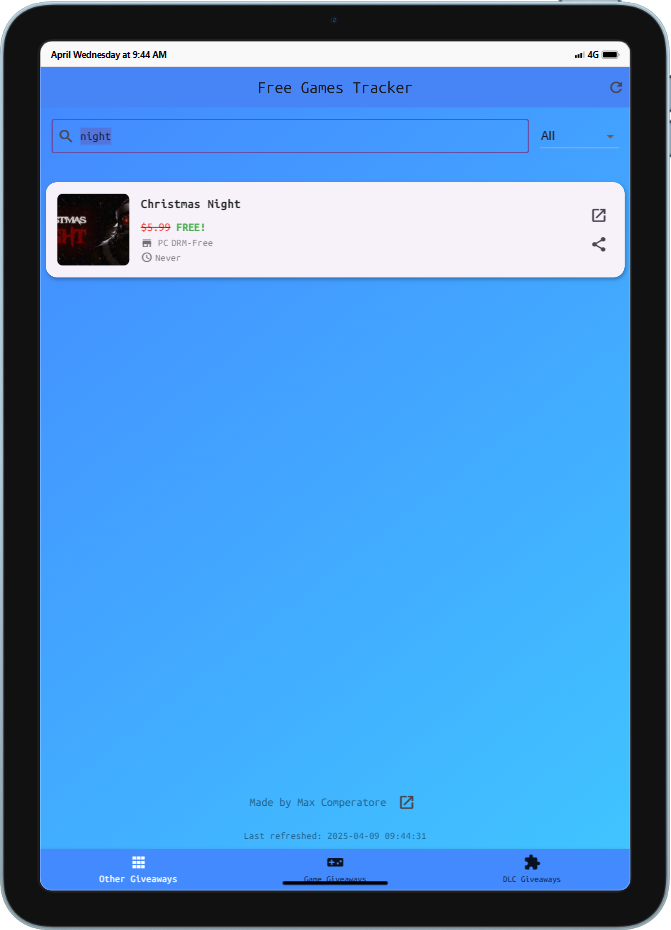

# FreeGamesApp

**FreeGamesApp** is a cross-platform application (Windows and Android) designed to help users stay up to date with the latest free game offers and exclusive downloadable content (DLC). It's built for gamers who want to discover time-limited promotions without having to manually browse multiple websites or platforms.

- [Web App](https://gamingdeals.netlify.app/)
- [Landing](https://pyoneerc1.itch.io/free-games-tracker)
---

## Key Features

- Instant access to active free game offers and promotions in one place.
- Automatic updates via a custom API built on top of [GamerPower](https://www.gamerpower.com/api).
- Clean and minimal interface focused solely on time-limited free games and DLC (no permanent free-to-play titles included).
- Available for both Windows and Android platforms.
- Open source project with a Flutter-based frontend and Python backend.

## Contributing

This is an open-source project. Whether you're looking to contribute code, learn about Flutter and API integration, or suggest improvements—you're welcome to explore the codebase and collaborate.

## Acknowledgements

Special thanks to **Colin Schmale**, creator of *War Report for Clash of Clans*, for his support and technical guidance in Flutter development.

